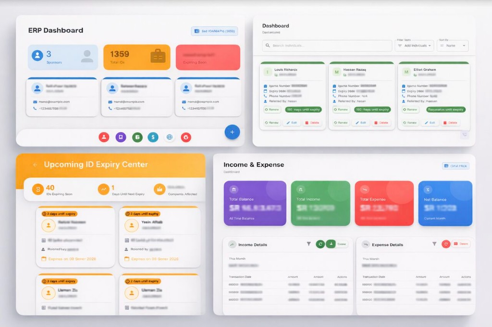

# Id Management System

Iqama (Saudi residency ID) lifecycle management for immigration and labor consulting firms. Track sponsors, companies, workers, renewals, regulatory fees, and income/expense ledgers with role-based access and an admin approval workflow.



---

## Overview

| Area | Description |
|------|-------------|
| **Domain** | Saudi Iqama compliance, renewals, and related company fees (CR, Qiwa, Muqeem, EFA, Saudi) |
| **Users** | Admins (full access) and staff (scoped to assigned MainPersons; writes go through approval) |
| **Stack** | Node.js, Express, MongoDB/Mongoose · React, Vite, Material UI · JWT auth |
| **Deploy** | Frontend on Vercel · API on Render · Database on MongoDB Atlas |

---

## Features

- **Sponsor hierarchy** — MainPerson → Company → Individual (Iqama)
- **Expiry compliance** — Red (expired), orange (≤30 days), green (>30 days)
- **Payments** — Configurable Iqama price, partial payments, renewal reset of payment periods
- **Company fees** — CR / Qiwa / Muqeem / EFA / Saudi with automated payment status
- **Approval workflow** — Non-admin ADD / RENEW / PAYMENT requests staged until admin approve/reject
- **Finance** — Income (worker Iqama) and expense (company fees) ledgers, including Nasser-isolated views
- **i18n** — English / Arabic with RTL
- **PDF** — ID cards and reports
- **Bulk migration** — Nested company and individual import with transactions

---

## Architecture

```
Frontend (React / Vite / MUI) ──JWT──► Backend (Express) ──► MongoDB Atlas
         │                                    │
         │                                    ├── Direct writes (admin)
         │                                    └── NotifyAdmin / NotifyCompanyAdmin
         │                                          └── Approve → records + ledger
         └── Vercel rewrite /api → Render
```

**Data model (simplified):**

```
MainPerson
  └── Company (fees, paymentStatus)
        └── Individual (iqamaNumber, expiry, paymentHistory)

User (isAdmin, allowedMainPersons, hasIncomeAccess)
Income / Expense
NotifyAdmin · NotifyCompanyAdmin
IqamaPrice
```

Business logic lives primarily in Express route handlers; Mongoose models hold schemas, virtuals, and hooks. There is no separate service/repository layer.

---

## Tech Stack

| Layer | Technologies |
|-------|----------------|
| Backend | Node.js 20, Express 4, Mongoose 7, JWT, bcryptjs |
| Frontend | React 18, Vite 5, Material UI 5, React Router 6, Axios |
| i18n / PDF | i18next, stylis-plugin-rtl, jsPDF, html2canvas |
| Auth | JWT (Bearer), role claims in token |

---

## Repository Structure

```
IdManagementSystem/
├── backend/                 # Express API
│   ├── src/
│   │   ├── config/          # DB connection
│   │   ├── controllers/     # Approval & company stats
│   │   ├── middleware/      # JWT protect / adminProtect
│   │   ├── models/          # Mongoose schemas
│   │   ├── routes/          # REST endpoints (primary logic)
│   │   ├── scripts/         # Seed, admin, migrations
│   │   ├── app.js
│   │   └── server.js
│   └── package.json
├── frontend/                # React SPA
│   ├── src/
│   │   ├── components/
│   │   ├── context/         # AuthContext
│   │   ├── pages/
│   │   ├── services/        # Axios API client
│   │   └── utils/pdf/
│   └── package.json
├── docs/images/             # README assets
├── .gitignore
└── README.md
```

---

## Getting Started

### Prerequisites

- Node.js **20.x**
- MongoDB (local or Atlas)
- npm

### 1. Clone and install

```bash
git clone <repository-url>
cd IdManagementSystem

cd backend && npm install && cd ..
cd frontend && npm install && cd ..
```

### 2. Environment variables

**Backend** (`backend/.env`):

```env
MONGODB_URI=mongodb+srv://<user>:<password>@<cluster>/<db>
JWT_SECRET=your-strong-secret
PORT=3000
```

**Frontend** (`frontend/.env`):

```env
VITE_API_URL=http://localhost:3000
```

Do not commit `.env` files; they are listed in `.gitignore`.

### 3. Run locally

```bash
# API (from backend/)
npm run dev

# SPA (from frontend/)
npm run dev
```

Optional scripts (from `backend/`):

| Script | Purpose |
|--------|---------|
| `npm run create-admin` | Bootstrap admin user |
| `npm run create-users` | Create sample users |
| `npm run seed` | Seed domain data |
| `npm run seed-finance` | Seed income/expense |

---

## API Surface

| Prefix | Responsibility |
|--------|----------------|
| `/api/auth` | Login, token refresh |
| `/api/main-persons` | Sponsors |
| `/api/companies` | Companies, payments, stats, bulk migrate |
| `/api/individuals` | Individuals, expiry queries, pay pending |
| `/api/notify-admin` | Individual approval queue |
| `/api/notify-company-admin` | Company approval queue |
| `/api/income` · `/api/expense` | Finance (excludes Nasser partition) |
| `/api/nasser` | Nasser-only finance |
| `/api/iqama-price` | Global Iqama price |
| `/api/users` | User administration |

---

## Authorization Model

| Role | Behavior |
|------|----------|
| **Admin** (`isAdmin`) | Direct CRUD, approve/reject notifications, user management |
| **Staff** | Scoped by `allowedMainPersons`; mutations create pending notifications |

Additional claim: `hasIncomeAccess` (`none` \| `nasser` \| `company`) gates finance UI and related routes.

One MainPerson (Nasser) is deliberately segregated with dedicated notification and ledger routes for operational isolation.

---

## Approval Workflow

1. Staff submits ADD / RENEW / PAYMENT → `NotifyAdmin` or `NotifyCompanyAdmin`
2. Admin reviews in Admin Notifications (or Nasser-specific queue)
3. On approve: create/update live records and related Income/Expense entries
4. Notification is removed (or marked rejected)

This keeps operational data clean until an admin confirms the change.

---

## Core Business Flows

```
Individual:  Add → Pay (partial/full) → Track expiry → Renew (reset payment period)
Company:     Create → CR / Qiwa / Muqeem / EFA / Saudi fees → paymentStatus updates
Finance:     Iqama receipts → Income · Company fees → Expense · Balance aggregations
Compliance:  Expiry windows → colored alerts → renewals
```

---

## Deployment

| Component | Host |
|-----------|------|
| Frontend | [Vercel](https://vercel.com) (`frontend/vercel.json` rewrites `/api` to the Render backend) |
| Backend | [Render](https://render.com) — `node src/server.js`, Node 20 |
| Database | MongoDB Atlas |

Set the same env vars in each host. Point `VITE_API_URL` at the production API (or rely on same-origin `/api` rewrites).

---

## License

ISC
